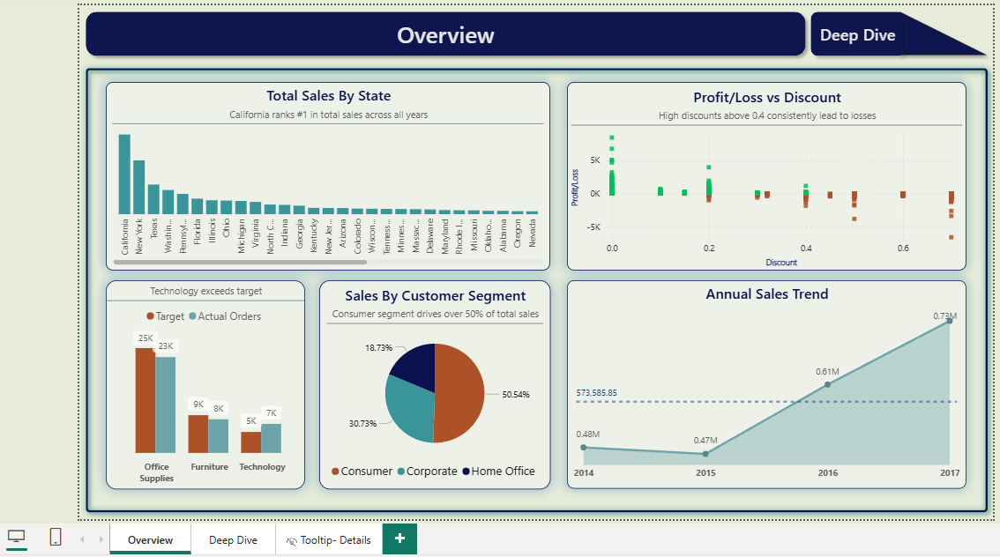
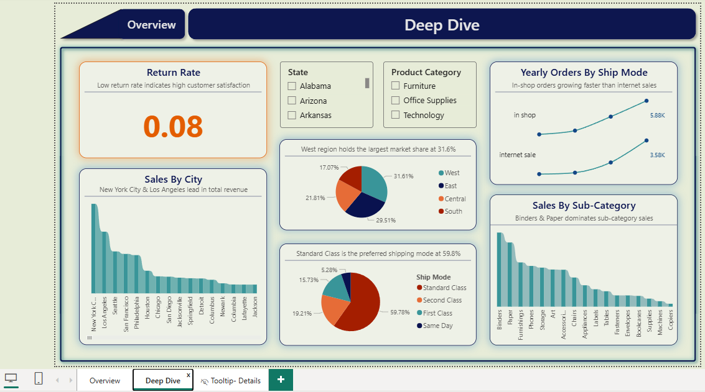
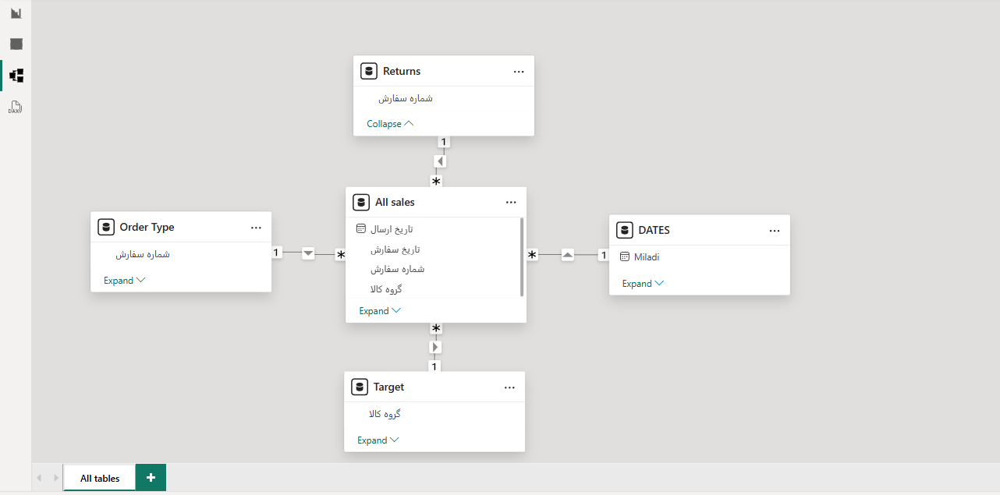

# 📊 Power BI Sales Analytics Dashboard

> **University Project** | Data Analytics & Business Intelligence  
> Author: **Nika Oghbaei**

---

## 🎯 Project Overview

This is an end-to-end sales analytics project built with **Power BI Desktop**. The project analyzes retail sales data spanning from **2014 to 2017**, covering multiple dimensions including geographic performance, customer behavior, product categories, shipping methods, and profitability analysis.

The dashboard transforms raw transactional data into actionable business insights through interactive visualizations, dynamic KPIs, and drill-through capabilities.

---

## 📈 Key Performance Indicators (KPIs)

| Metric | Value |
|--------|-------|
| **Total Orders** | 285.92K |
| **Total Sales** | $2.29M |
| **Total Profit** | $38K |
| **Return Rate** | 0.08 (8%) |

---

## 📊 Dashboard Pages

### 1. Overview Dashboard

The main executive summary providing a high-level view of business performance.

**Components:**
- **Return Rate Card** – Dynamic indicator showing 8% return rate with conditional formatting
- **State Filter** – Interactive slicer for state-level analysis (Alabama, Arizona, Arkansas, etc.)
- **Product Category Filter** – Filter by Furniture, Office Supplies, and Technology
- **Sales by City** – Bar chart showing top-performing cities (New York City & Los Angeles lead)
- **Regional Market Share** – Pie chart showing:
  - West: 31.61%
  - East: 29.51%
  - Central: 21.81%
  - South: 17.07%
- **Ship Mode Distribution** – Pie chart showing:
  - Standard Class: 59.78%
  - Second Class: 19.21%
  - First Class: 15.73%
  - Same Day: 5.28%
- **Yearly Orders by Ship Mode** – Line chart comparing in-shop vs internet sales trends
- **Sales by Sub-Category** – Bar chart showing top sub-categories (Binders & Paper dominate)

### 2. Deep Dive Dashboard

Detailed analysis for granular insights and trend identification.

**Components:**
- **Total Sales by State** – California ranks #1 in total sales across all years
- **Profit/Loss vs Discount** – Scatter analysis showing high discounts above 0.4 consistently lead to losses
- **Target vs Actual Orders** – Comparison by category:
  - Office Supplies: 25K target vs 23K actual
  - Furniture: 9K target vs 8K actual
  - Technology: 5K target vs 7K actual (exceeds target)
- **Sales by Customer Segment** – Donut chart:
  - Consumer: 50.54%
  - Corporate: 30.73%
  - Home Office: 18.73%
- **Annual Sales Trend** – Area chart showing growth from 2014 to 2017 (peak at 0.73M)

### 3. Tooltip - Details

Dynamic tooltip page providing additional context when hovering over visualizations.

---

## 🗄️ Data Model (Star Schema)

The project implements a **Star Schema** data modeling approach for optimal query performance and scalability.

### Fact Table

| Table | Description | Key Columns |
|-------|-------------|-------------|
| **All sales** | Main transactional fact table | تاریخ ارسال, تاریخ سفارش, شماره سفارش, گروه کالا, نام مشتری, نوع مشتری, کشور, شهر, ایالت, ناحیه, کد کالا |

### Dimension Tables

| Table | Description | Key Columns |
|-------|-------------|-------------|
| **DATES** | Date dimension for time intelligence | Miladi (Gregorian date) |
| **Returns** | Return transactions tracking | شماره سفارش |
| **Order Type** | Order classification | شماره سفارش |
| **Target** | Sales targets by category | گروه کالا |

### Relationships

All sales[تاریخ سفارش] ──────► DATES[Miladi]      (Many-to-One)  
All sales[شماره سفارش] ──────► Returns[شماره سفارش] (Many-to-One)  
All sales[شماره سفارش] ──────► Order Type[شماره سفارش] (Many-to-One)  
All sales[گروه کالا] ──────► Target[گروه کالا]     (Many-to-One)  

---

## 📁 Data Sources

| File | Size | Description |
|------|------|-------------|
| `sale_total.xlsx` | 891 KB | Complete sales dataset (2014-2017) |
| `sale_2014.xlsx` | 246 KB | Sales data for year 2014 |
| `order type.xlsx` | 93.44 KB | Order classification data |

### Data Schema

The `All sales` table contains the following columns:

| Column Name | Description |
|-------------|-------------|
| شماره سفارش | Order ID |
| تاریخ سفارش | Order Date |
| تاریخ ارسال | Shipping Date |
| نوع ارسال | Shipping Mode (Standard, First, Second, Same Day) |
| نام مشتری | Customer Name |
| نوع مشتری | Customer Segment (Consumer, Corporate, Home Office) |
| کشور | Country |
| شهر | City |
| ایالت | State |
| ناحیه | Region (West, East, Central, South) |
| کد کالا | Product Code |
| گروه کالا | Product Category (Furniture, Office Supplies, Technology) |

---

## 🛠️ Tools & Technologies

| Tool | Usage |
|------|-------|
| **Power BI Desktop** | Data visualization, dashboard creation, DAX calculations |
| **Power Query** | ETL (Extract, Transform, Load) operations |
| **DAX** | Custom measures, calculated columns, time intelligence |
| **Microsoft Excel** | Source data format |
| **Star Schema** | Data modeling architecture |

---

## 📊 DAX Measures Used

The project includes custom DAX calculations for:

- **Return Rate** = DIVIDE(COUNT(Returns), COUNT(All sales), 0)
- **Total Sales** = SUM(All sales[فروش])
- **Total Profit** = SUM(All sales[سود])
- **YoY Growth** = Growth percentage calculation
- **Running Total** = Cumulative sales calculation

---

## 🎨 Design Features

- **Dynamic Color Formatting** – Return rate card changes color based on value (conditional formatting)
- **Interactive Slicers** – State and Product Category filters for dynamic analysis
- **Drill-Through Navigation** – Click on any visualization to see detailed breakdown
- **Tooltip Pages** – Custom tooltips providing additional context on hover
- **Consistent Theme** – Professional dark blue (#003366) and teal (#4472C4) color scheme

---

## 📸 Dashboard Screenshots

### Overview Dashboard

### Deep Dive Dashboard

### Data Model View

---

## 💡 Key Business Insights

1. **Regional Performance** – The West region dominates with 31.61% market share, while the South has the lowest at 17.07%

2. **Discount Impact** – Discounts above 0.4 consistently lead to losses, suggesting a need for discount policy review

3. **Customer Segmentation** – Consumer segment drives over 50% of total sales, making it the primary target market

4. **Shipping Preferences** – Standard Class is the overwhelming choice at 59.78%, indicating cost-conscious customers

5. **Technology Growth** – Technology category exceeds sales targets, showing strong growth potential

6. **Geographic Concentration** – New York City and Los Angeles are the top-performing cities in total revenue

7. **Sub-Category Dominance** – Binders & Paper dominate sub-category sales, indicating high demand for office supplies

---

## 🚀 How to Use

1. **Download** the `.pbix` file from the `reports/` folder
2. **Open** with Power BI Desktop (free download from Microsoft)
3. **Ensure** data files are in the `data/` folder
4. **Refresh** data connections if needed
5. **Interact** with slicers and filters to explore insights

---

## 📝 License

This project is licensed under the MIT License - see the [LICENSE](LICENSE) file for details.

---

## 👤 Author

**Nika Oghbaei**  
University Project - February 2026

---

## 🙏 Acknowledgments

- University faculty for guidance and support
- Power BI community for best practices
- Dataset contributors for providing the sales data
